# linux-basics-commands

## ls Command Options and Sample Output

---

## ls
Lists files and directories in the current directory.

---

## ls -a
Lists all files, including hidden files (files starting with `.`).

---

## ls -l
Lists files in long format showing permissions, ownership, size, and timestamps.

---

## ls -lh
Lists files in long format with human-readable file sizes.

---

## ls -lr
Lists files in reverse alphabetical order.

---

## ls -ltr
Lists files in long format sorted by modification time (oldest first).

---

## cd
Changes the current working directory.
## cd ..
Moves to the parent directory.
## cd ~
Moves to the home directory.
## cd -
Switches to the previous directory.

---

## mkdir
Creates a new directory.
## mkdir -p
Creates parent directories if they do not exist.
## mkdir -v
Displays a message for each created directory.

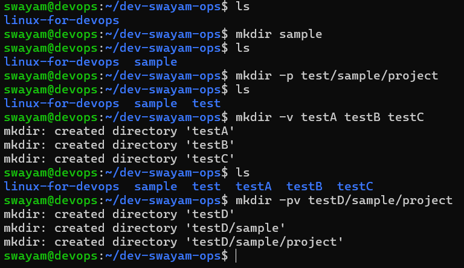

---

## rmdir
Deletes an empty directory.
## rmdir -p
Deletes parent directories if they are empty.
## rmdir -v
Displays a message for each removed directory.

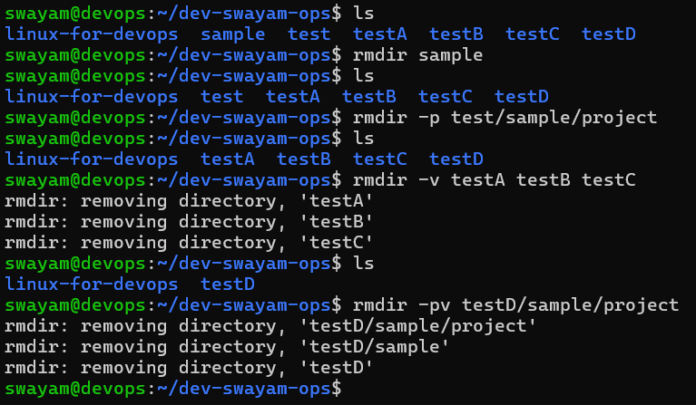

---

## pwd
Prints the current working directory.
## pwd -L
Prints the logical path (default).
## pwd -P
Prints the physical path (resolves symbolic links).

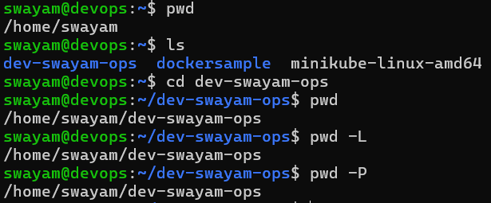
---

## touch
Creates an empty file or updates file timestamps.
## touch -c
Does not create a file if it does not exist.
## touch -t 
Sets a specific timestamp for a file.
(touch -t [[CC]YY]MMDDhhmm[.ss] file)

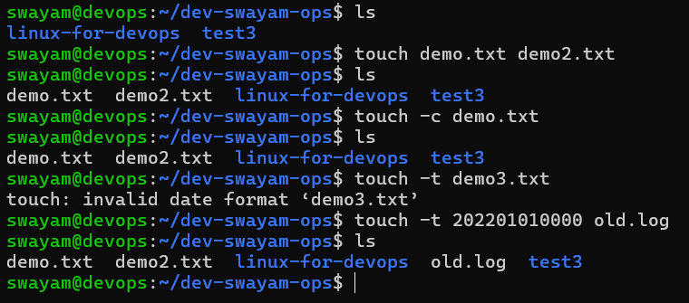
---

## rm
Deletes files or directories.
## rm -r
Deletes directories and their contents recursively.
## rm -f
Forces deletion without confirmation.
## rm -i
Prompts before each deletion.

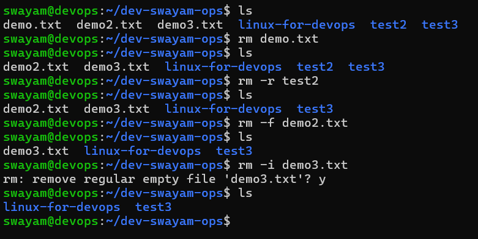
---

## mv
Moves or renames files and directories.
## mv -v
Displays verbose output.

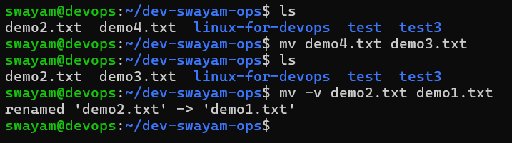
---

## cp
Copies files or directories.
## cp -r
Copies directories recursively.
## cp -v
Displays verbose output.

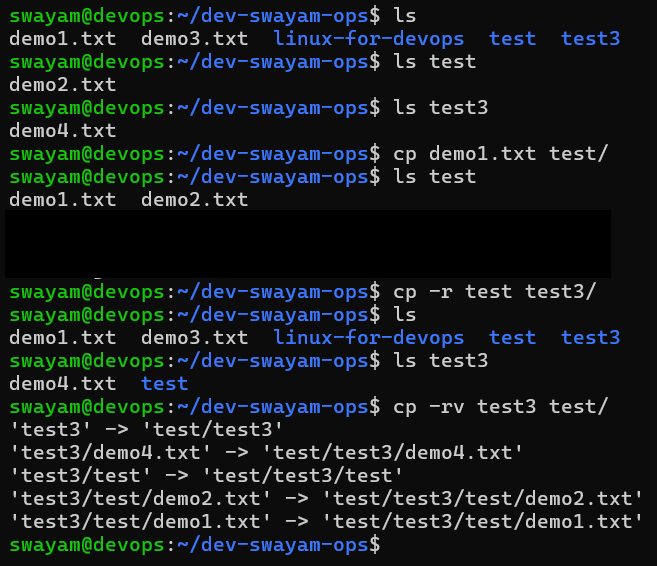

---

## cat
Displays the contents of a file.
## cat -n
Numbers all output lines.
## cat -b
Numbers only non-empty lines.
## cat -A
Displays all characters including tabs and line endings.
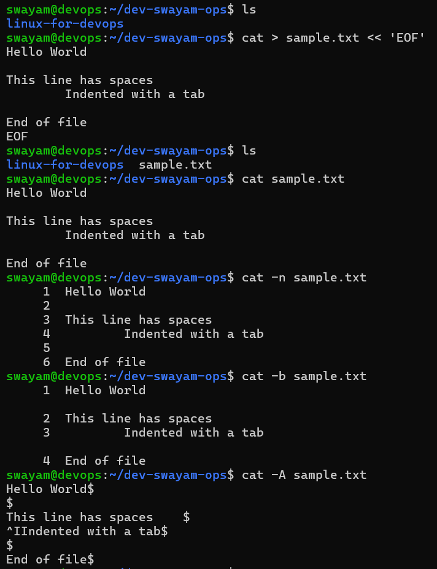
---

## more
Displays file contents one screen at a time (forward only).
## more -d
Displays help prompt instead of ringing the bell.
## more -f
Counts logical lines instead of wrapped lines.

---

## less
Displays file contents with forward and backward navigation.
## less -N
Displays line numbers.
## less -S
Disables line wrapping.
## less +F
Follows file updates (similar to `tail -f`).

---

## head
Displays the first 10 lines of a file.
## head -n
Displays a specified number of lines.
## head -c
Displays a specified number of bytes.

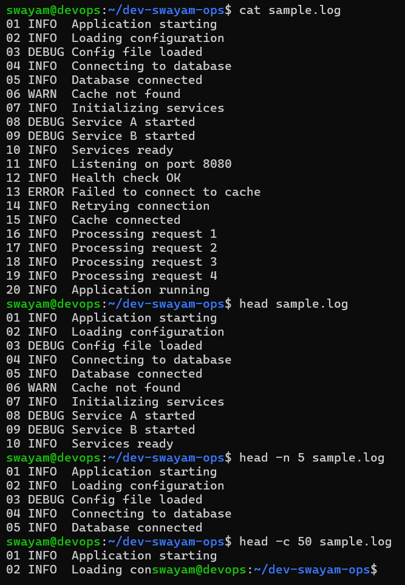
---

## tail
Displays the last 10 lines of a file.
## tail -n
Displays a specified number of lines.
## tail -c
Displays a specified number of bytes.
## tail -f
Follows file updates in real time (commonly used for logs).

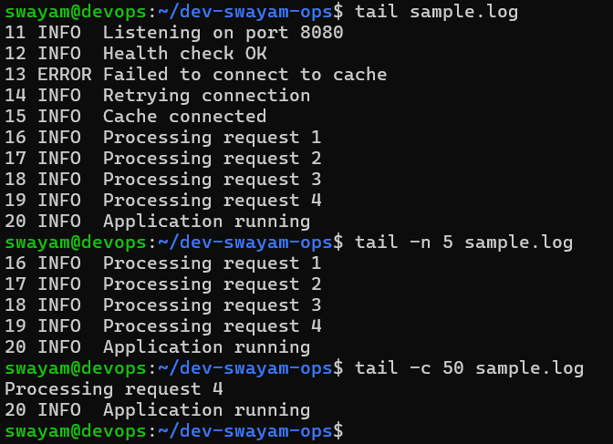
---

## rev
Reverses each line of input text character-wise.

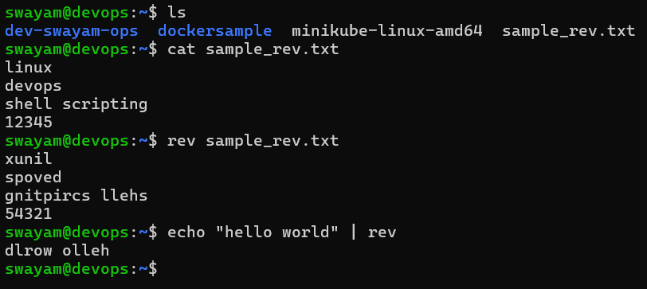
---
