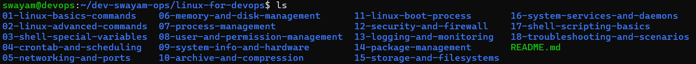
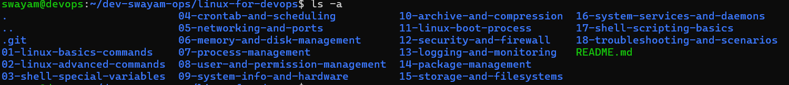

# linux-basics-commands

# ls Command Options and sample output

## ls
Lists files and directories in the current directory.

---

## ls -a
Lists all files, including hidden files (files starting with `.`).

---

## ls -l
Lists files in long format showing permissions, ownership, size, and timestamps.
 
---

## ls -lh
Lists files in long format with human-readable file sizes.
 
---

## ls -lr
Lists files in reverse alphabetical order.
 
---

## ls -ltr
Lists files in long format sorted by modification time (oldest first).
 

